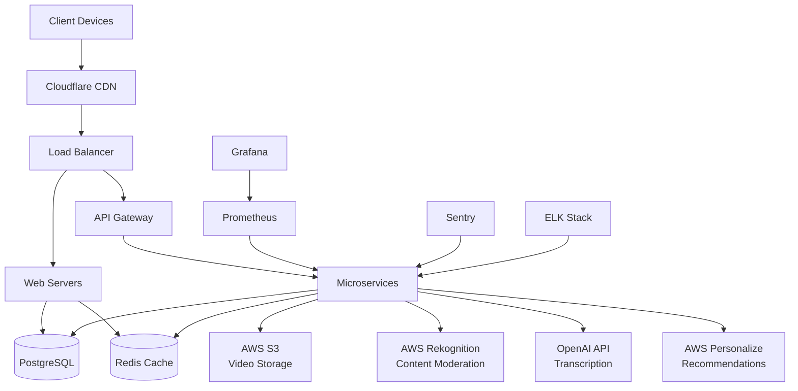

# StreamHub Architecture & Setup Guide

## 1. High-Level System Architecture



### Architecture Components

1. **Frontend Layer**
   - React application served via CDN
   - Responsive design for all device types
   - Progressive Web App capabilities

2. **API Gateway Layer**
   - Entry point for all client requests
   - Rate limiting and request routing
   - SSL termination

3. **Application Layer**
   - Node.js/Express microservices
   - Stateless design for horizontal scaling
   - Containerized with Docker

4. **Data Layer**
   - PostgreSQL for relational data
   - Redis for caching and sessions
   - AWS S3 for video storage

5. **AI Services**
   - OpenAI for transcription and NLP
   - AWS Rekognition for content moderation
   - AWS Personalize for recommendations

6. **Observability Layer**
   - Prometheus for metrics collection
   - Grafana for visualization
   - ELK Stack for log aggregation
   - Sentry for error tracking

## 2. Database Schema

### Users Table
```sql
CREATE TABLE users (
    id SERIAL PRIMARY KEY,
    username VARCHAR(50) UNIQUE NOT NULL,
    email VARCHAR(100) UNIQUE NOT NULL,
    password_hash VARCHAR(255) NOT NULL,
    role VARCHAR(20) DEFAULT 'user',
    profile_image_url TEXT,
    bio TEXT,
    created_at TIMESTAMP DEFAULT CURRENT_TIMESTAMP,
    updated_at TIMESTAMP DEFAULT CURRENT_TIMESTAMP,
    is_verified BOOLEAN DEFAULT FALSE,
    is_active BOOLEAN DEFAULT TRUE
);
```

### Videos Table
```sql
CREATE TABLE videos (
    id SERIAL PRIMARY KEY,
    user_id INTEGER REFERENCES users(id),
    title VARCHAR(255) NOT NULL,
    description TEXT,
    video_url TEXT NOT NULL,
    thumbnail_url TEXT,
    duration INTEGER, -- in seconds
    visibility VARCHAR(20) DEFAULT 'public', -- public, private, unlisted
    status VARCHAR(20) DEFAULT 'processing', -- processing, available, disabled
    views_count INTEGER DEFAULT 0,
    likes_count INTEGER DEFAULT 0,
    dislikes_count INTEGER DEFAULT 0,
    created_at TIMESTAMP DEFAULT CURRENT_TIMESTAMP,
    updated_at TIMESTAMP DEFAULT CURRENT_TIMESTAMP
);
```

### Categories Table
```sql
CREATE TABLE categories (
    id SERIAL PRIMARY KEY,
    name VARCHAR(100) UNIQUE NOT NULL,
    description TEXT,
    created_at TIMESTAMP DEFAULT CURRENT_TIMESTAMP
);
```

### Video Categories Junction Table
```sql
CREATE TABLE video_categories (
    video_id INTEGER REFERENCES videos(id),
    category_id INTEGER REFERENCES categories(id),
    PRIMARY KEY (video_id, category_id)
);
```

### Comments Table
```sql
CREATE TABLE comments (
    id SERIAL PRIMARY KEY,
    video_id INTEGER REFERENCES videos(id),
    user_id INTEGER REFERENCES users(id),
    parent_id INTEGER REFERENCES comments(id), -- for threaded comments
    content TEXT NOT NULL,
    likes_count INTEGER DEFAULT 0,
    dislikes_count INTEGER DEFAULT 0,
    created_at TIMESTAMP DEFAULT CURRENT_TIMESTAMP,
    updated_at TIMESTAMP DEFAULT CURRENT_TIMESTAMP,
    is_deleted BOOLEAN DEFAULT FALSE
);
```

### Likes Table
```sql
CREATE TABLE likes (
    id SERIAL PRIMARY KEY,
    user_id INTEGER REFERENCES users(id),
    video_id INTEGER REFERENCES videos(id),
    comment_id INTEGER REFERENCES comments(id),
    type VARCHAR(10) NOT NULL, -- like, dislike
    created_at TIMESTAMP DEFAULT CURRENT_TIMESTAMP,
    UNIQUE(user_id, video_id, comment_id)
);
```

### Subscriptions Table
```sql
CREATE TABLE subscriptions (
    id SERIAL PRIMARY KEY,
    subscriber_id INTEGER REFERENCES users(id),
    subscribed_to_id INTEGER REFERENCES users(id),
    created_at TIMESTAMP DEFAULT CURRENT_TIMESTAMP,
    UNIQUE(subscriber_id, subscribed_to_id)
);
```

### Video Transcripts Table
```sql
CREATE TABLE video_transcripts (
    id SERIAL PRIMARY KEY,
    video_id INTEGER REFERENCES videos(id),
    language_code VARCHAR(10) NOT NULL,
    content TEXT NOT NULL,
    created_at TIMESTAMP DEFAULT CURRENT_TIMESTAMP,
    updated_at TIMESTAMP DEFAULT CURRENT_TIMESTAMP,
    UNIQUE(video_id, language_code)
);
```

### Notifications Table
```sql
CREATE TABLE notifications (
    id SERIAL PRIMARY KEY,
    user_id INTEGER REFERENCES users(id),
    type VARCHAR(50) NOT NULL,
    content TEXT NOT NULL,
    is_read BOOLEAN DEFAULT FALSE,
    created_at TIMESTAMP DEFAULT CURRENT_TIMESTAMP
);
```

## 3. API Endpoints and Microservices Plan

### Authentication Service
```
POST /api/auth/signup          # User registration
POST /api/auth/login           # User login
POST /api/auth/logout          # User logout
POST /api/auth/refresh         # Refresh token
POST /api/auth/forgot-password # Password reset request
POST /api/auth/reset-password  # Password reset
```

### User Service
```
GET /api/users/profile         # Get user profile
PUT /api/users/profile         # Update user profile
GET /api/users/{id}            # Get public user profile
GET /api/users/videos          # Get user's videos
```

### Video Service
```
POST /api/videos               # Upload video
GET /api/videos                # List videos
GET /api/videos/{id}           # Get video details
PUT /api/videos/{id}           # Update video
DELETE /api/videos/{id}        # Delete video
GET /api/videos/{id}/transcript # Get video transcript
```

### Comment Service
```
POST /api/videos/{id}/comments # Add comment
GET /api/videos/{id}/comments  # List comments
PUT /api/comments/{id}         # Update comment
DELETE /api/comments/{id}      # Delete comment
POST /api/comments/{id}/like   # Like comment
```

### Interaction Service
```
POST /api/videos/{id}/like     # Like video
POST /api/videos/{id}/dislike  # Dislike video
POST /api/users/{id}/subscribe # Subscribe to user
DELETE /api/users/{id}/subscribe # Unsubscribe from user
```

### Recommendation Service
```
GET /api/recommendations       # Get recommended videos
GET /api/trending              # Get trending videos
```

### Admin Service
```
GET /api/admin/videos          # List all videos
PUT /api/admin/videos/{id}     # Moderate video
GET /api/admin/users           # List all users
PUT /api/admin/users/{id}      # Moderate user
```

## 4. Observability Plan

### Logging
- Structured JSON logging for all services
- Centralized log aggregation with ELK Stack
- Log levels: DEBUG, INFO, WARN, ERROR, FATAL
- Request tracing with correlation IDs

### Metrics
- Application metrics with Prometheus
- Custom business metrics (user registrations, video uploads, etc.)
- System metrics (CPU, memory, disk, network)
- API response times and error rates

### Alerting
- Critical alerts for system downtime
- Warning alerts for performance degradation
- Business metric alerts (unusual activity patterns)
- Notification channels: Email, Slack, SMS

### Dashboards
- System health dashboard
- Business metrics dashboard
- User engagement dashboard
- Error tracking dashboard

## 5. Security Measures

### Authentication & Authorization
- JWT tokens with asymmetric encryption
- Role-based access control (RBAC)
- Session management with Redis
- OAuth 2.0 integration options

### Data Protection
- TLS 1.3 encryption for data in transit
- AES-256 encryption for sensitive data at rest
- Secure password hashing with bcrypt
- Regular key rotation

### Input Validation
- Strict input validation on all endpoints
- SQL injection prevention with parameterized queries
- XSS protection with content sanitization
- CSRF protection tokens

### OWASP Best Practices
- Protection against Top 10 vulnerabilities
- Regular security scanning
- Dependency vulnerability scanning
- Security headers implementation

## 6. AI Integrations

### Recommendation Engine
- AWS Personalize for personalized video recommendations
- Collaborative filtering algorithms
- Content-based filtering
- Real-time model updates

### Auto-Transcription
- OpenAI Whisper API for speech-to-text conversion
- Multi-language support
- Confidence scoring for transcription quality
- Editable transcripts

### Content Moderation
- AWS Rekognition for image/video analysis
- Text moderation with AWS Comprehend
- Automated flagging of inappropriate content
- Human review workflow for edge cases

## 7. Deployment Strategy

### Environments
1. **Development**
   - Local development with Docker Compose
   - Feature branch deployments
   - Minimal resource allocation

2. **Staging**
   - Pre-production environment
   - Mirror of production setup
   - Integration testing

3. **Production**
   - Highly available setup
   - Auto-scaling groups
   - Blue-green deployment strategy

### Infrastructure as Code
- Terraform for AWS resource provisioning
- Kubernetes manifests for application deployment
- Helm charts for complex deployments

## 8. CI/CD Pipeline

### Build Process
1. Code checkout from Git repository
2. Dependency installation
3. Security scanning
4. Unit testing
5. Integration testing
6. Docker image building
7. Image pushing to container registry

### Deployment Process
1. Automated testing in staging
2. Manual approval for production
3. Blue-green deployment
4. Health checks
5. Rollback on failure

### Testing Strategy
- Unit tests for all business logic
- Integration tests for API endpoints
- End-to-end tests for critical user flows
- Performance testing with load simulation
- Security scanning in pipeline

## 9. Local Development Setup

### Prerequisites
- Node.js 18+
- Docker and Docker Compose
- PostgreSQL client
- Redis client
- Git

### Environment Variables
Create a `.env` file in the root directory:
```env
# Database
DB_HOST=localhost
DB_PORT=5432
DB_NAME=streamhub_dev
DB_USER=streamhub_user
DB_PASSWORD=streamhub_password

# Redis
REDIS_HOST=localhost
REDIS_PORT=6379

# JWT
JWT_SECRET=your_jwt_secret_key
JWT_EXPIRES_IN=24h

# AWS
AWS_ACCESS_KEY_ID=your_aws_access_key
AWS_SECRET_ACCESS_KEY=your_aws_secret_key
AWS_REGION=us-east-1

# OpenAI
OPENAI_API_KEY=your_openai_api_key

# Storage
VIDEO_STORAGE_BUCKET=streamhub-videos
THUMBNAIL_STORAGE_BUCKET=streamhub-thumbnails

# Ports
API_PORT=3000
CLIENT_PORT=3001
```

### Database Setup
1. Start PostgreSQL and Redis with Docker Compose:
```bash
docker-compose up -d postgres redis
```

2. Create database and user:
```sql
CREATE DATABASE streamhub_dev;
CREATE USER streamhub_user WITH ENCRYPTED PASSWORD 'streamhub_password';
GRANT ALL PRIVILEGES ON DATABASE streamhub_dev TO streamhub_user;
```

3. Run database migrations:
```bash
npm run migrate
```

### Starting the Application
1. Install dependencies:
```bash
npm install
```

2. Start backend services:
```bash
npm run dev:server
```

3. Start frontend:
```bash
npm run dev:client
```

4. Access the application at `http://localhost:3001`